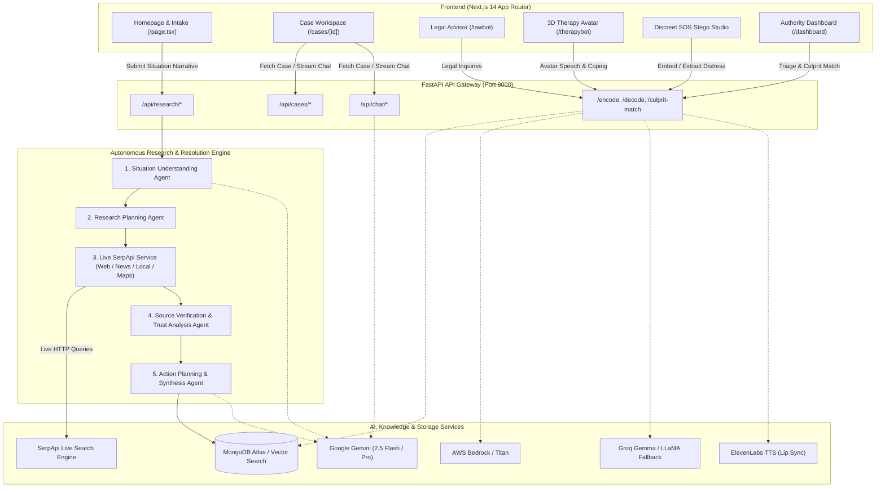

<div align="center">

# 🛡️ Haven  
### *A Silent Shield, A Strong Voice — AI-Powered Women Safety & Autonomous Real-World Case Resolution*

[](https://fastapi.tiangolo.com)
[](https://nextjs.org)
[](https://www.typescriptlang.org)
[](https://python.org)
[](https://mongodb.com)
[](https://serpapi.com)
[](https://ai.google.dev)
[](https://opensource.org/licenses/MIT)

---

**Haven** is an end-to-end, production-grade AI platform built to empower women in abusive, hazardous, or complex situations by providing **discreet safety channels**, **autonomous real-world investigation powered by live search**, **legal guidance**, **3D empathetic therapy**, and **step-by-step actionable resolution plans**.

[**Explore Architecture**](#-system-architecture) • [**Quick Start**](#-quick-start--installation) • [**Feature Tour**](#-core-capabilities--feature-deep-dive) • [**API Reference**](#-api-reference)

---

</div>

## 🌟 Vision & Problem Statement

Globally, **1 in 3 women** experiences physical, emotional, or sexual abuse in her lifetime. In domestic and intimate partner abuse scenarios:
- **Digital Surveillance is Rampant**: Abusers routinely monitor browser history, text messages, phone logs, and app lists, making direct calls for help extremely dangerous.
- **Access to Legal & Mental Health Support is Severely Constrained**: Less than 14% of survivors have access to formal legal aid, and only 10% receive mental health assistance.
- **Information Overload & Misinformation**: In a crisis, survivors face generic, outdated advice rather than verified local shelter contacts, jurisdiction-specific legal procedures, and step-by-step safety roadmaps.

### The Haven Solution
Haven unifies two powerful layers into one seamless system:
1. **The Women-Centric Safety Shield**: Steganographic distress transmission hidden in innocuous social images, 3D animated empathetic AI therapy, RAG-powered legal counsel, emergency quick-exit switches, and authority triage dashboards with perpetrator vector matching.
2. **Autonomous Real-World Problem Resolution**: An agentic search and synthesis engine powered by **live SerpApi** that analyzes complex distress narratives, autonomously queries web/news/local/map sources, verifies domain trust, and builds tailored action plans with persistent case workspaces.

---

## 🏗️ System Architecture

Haven is organized as a decoupled, multi-agent system comprising a **FastAPI backend** (Python 3.12) and a **Next.js 14 App Router frontend** (TypeScript & Tailwind CSS).



---

## 🚀 Core Capabilities & Feature Deep-Dive

### 1. 🔍 Autonomous Real-World Case Resolution (Powered by SerpApi)
When a user describes a difficult situation ("My landlord locked me out illegally while my abusive partner is threatening me in Austin, TX"), Haven executes an autonomous 5-stage research pipeline:

```
[User Situation Narrative] 
   │
   ├──► [Stage 1: Situation Understanding]
   │       • Extracts core facts, urgency (Low/Medium/High/Critical), jurisdiction, timeline, missing context
   │
   ├──► [Stage 2: Research Planning]
   │       • Generates targeted search queries across Web, News, Local Shelters, and Maps
   │
   ├──► [Stage 3: Live SerpApi Execution]
   │       • Executes live HTTP queries (no hardcoded data)
   │       • Normalizes results into structured domain models (title, url, domain, snippet, rating, address)
   │
   ├──► [Stage 4: Source Verification & Trust Scoring]
   │       • Classifies domains: Official Government (.gov), Legal Aid (.org), Medical/Crisis vs General
   │       • Performs cross-source consensus verification and flags conflicting claims
   │
   └──► [Stage 5: Action Planning & Workspace Generation]
           • Synthesizes immediate safety steps, legal avenues, emergency contacts, local resources
           • Persists active case to MongoDB with interactive checklist tracking
```

#### Key Components:
- **`SerpApiService`** (`backend/services/serpapi_service.py`): Reusable, typed client supporting `search_web()`, `search_news()`, `search_local()`, and `search_maps()` with retries, timeout management, parameter validation, and rate-limiting.
- **`SourceVerifier`** (`backend/agents/source_verifier.py`): Calculates authority scores (0–100%), extracts verifiable citations, and surfaces official helpline numbers.
- **`ActionPlanner`** (`backend/agents/action_planner.py`): Builds sequenced phases (`Immediate Safety (0–2 hrs)`, `Short-term Actions (24–48 hrs)`, `Follow-Up & Legal Steps`).

---

### 2. 🗂️ Interactive Case Workspace & Memory (`/cases/[id]`)
A responsive 3-column command center designed for clarity during high-stress situations:

| Column | Contents & Capabilities |
| :--- | :--- |
| **Left: Situation & Facts** | Summary card, urgency badge, category tags, detected timeline, identified key facts, and flagged missing information. |
| **Center: Action Plan Checklist** | Interactive task list grouped by priority (Immediate, Short-term, Long-term). Users can toggle task completion, track progress percentage, and view safety warnings. Includes a **Download Case PDF** button. |
| **Right: Verified Evidence & Resources** | Verified source cards with trust badges (Gov, Legal, Crisis), clickable links, mapped phone numbers, address info, and ratings. |
| **Interactive Assistant Drawer** | In-case conversational AI with complete contextual memory of the case history, facts, and research findings. |
| **Research Trail Drawer** | Complete transparency drawer detailing exact search queries dispatched, query timestamps, raw SerpApi snippets, and verification scores. |

---

### 3. 🖼️ Discreet SOS Steganography Studio
Allows women living under digital surveillance to conceal distress messages inside innocent photos (e.g., flowers, pets, landscapes) before posting to social media or sending via messaging apps.

```
[User Distress Keywords] 
       │ 
       ▼ 
[Bedrock/Gemini Text Expansion] ──► "Help, locked in room by partner, need immediate assistance"
       │
       ▼
[AI Image Generation / Upload] ──► [Innocent Landscape Image]
       │
       ▼
[LSB Steganography Encoder]    ──► [Encoded Visual Image (Visually Identical)]
       │
       ▼ (Shared on Social Media with Trigger Hashtag)
[Authority Cron Scanner]       ──► Decodes Pixel Data ──► Extracts SOS ──► Triage Alert
```

- **Reverse Steganography**: Authorities decode the hidden payload from flagged image posts.
- **Text Decomposition**: Automatically parses extracted distress text into urgency levels, location markers, and suspect details.
- **Perpetrator Similarity Vector Match**: Generates embeddings of suspect descriptions and matches against historical records using MongoDB Atlas Vector Search ($vectorSearch).

---

### 4. 🤖 3D Empathetic Therapy Avatar (`/therapybot`)
- Built with **Three.js** and **React Three Fiber** (`@react-three/fiber`, `@react-three/drei`).
- Renders dynamic 3D humanoid avatars with synchronized facial morph targets (`viseme`, smiling, comforting, neutral).
- Integrates **ElevenLabs Text-to-Speech** for lifelike voice synthesis.
- Implements trauma-informed conversational guidelines for survivors experiencing panic, PTSD, or isolation.

---

### 5. ⚖️ Legal Rights & Constitution Advisor (`/lawbot`)
- RAG-powered legal assistant indexing statutory frameworks, women's protective legislation, domestic violence acts, custody procedures, and FIR filing rights.
- Translates dense statutory language into plain, actionable advice.
- Provides jurisdiction-aware templates for police complaints and restraining orders.

---

### 6. 🚨 Survivor Safety Features
- **Quick Escape / Panic Button**: Instantly redirects the browser to a harmless generic website (e.g., Google Weather or Wikipedia) and clears temporary in-memory state.
- **Decoy Mode**: Replaces the screen with a functional calculator/notes interface with a single keystroke (`Esc` / configurable).
- **Direct Helplines Drawer**: Instant access to emergency numbers (National Domestic Violence Hotline, Women's Helpline 1091/112, Crisis Text Lines).

---

## 📂 Project Directory Structure

```text
Haven-main/
├── backend/
│   ├── agents/                     # Autonomous AI Agents
│   │   ├── action_planner.py       # Synthesizes phased action plans & steps
│   │   ├── chat_agent.py           # In-case conversational assistant
│   │   ├── research_agent.py       # Query generator & research coordinator
│   │   ├── situation_agent.py      # Narrative decomposition & entity extraction
│   │   └── source_verifier.py      # Domain authority & consensus scoring
│   ├── routes/                     # FastAPI Endpoints
│   │   ├── cases.py                # CRUD for cases, action item toggling, PDF export
│   │   ├── chat.py                 # Case-aware chat session endpoints
│   │   ├── legacy.py               # Stego, lawbot, therapybot, SOS endpoints
│   │   └── research.py             # Multi-stage research pipeline endpoints
│   ├── services/                   # External API & Core Services
│   │   ├── llm_service.py          # Unified LLM provider (Gemini / Groq / Bedrock)
│   │   ├── maps_service.py         # Geocoding & spatial resource locator
│   │   ├── news_service.py         # News search aggregator
│   │   └── serpapi_service.py      # Robust SerpApi client (Web/News/Local/Maps)
│   ├── db.py                       # MongoDB connection & indexes
│   ├── logger.py                   # Structured logging utility
│   ├── main.py                     # FastAPI application entrypoint
│   ├── models/                     # Pydantic schemas and domain models
│   ├── prompts.py                  # Agent system prompts & templates
│   ├── requirements.txt            # Base backend dependencies
│   └── requirements-v2.txt         # Enhanced agent & research dependencies
│
├── frontend/
│   ├── src/
│   │   ├── app/                    # Next.js 14 App Router
│   │   │   ├── cases/              # Case Workspace & Case List views
│   │   │   │   ├── [id]/page.tsx   # 3-Column Interactive Case Command Center
│   │   │   │   └── page.tsx        # Case History & Saved Cases
│   │   │   ├── lawbot/             # AI Legal Advisor
│   │   │   ├── therapybot/         # 3D Animated Therapy Avatar
│   │   │   ├── dashboard/          # Authority Incident Management
│   │   │   ├── layout.tsx          # Root Layout with Clerk Auth & Theme
│   │   │   └── page.tsx            # Main Landing & "What's Going On?" Intake
│   │   ├── components/             # Reusable UI Components
│   │   │   ├── Navbar.tsx          # Navigation with Quick Exit & Panic Trigger
│   │   │   ├── InputForm.tsx       # Smart Intake Form with Live Timeline
│   │   │   ├── Timeline.tsx        # Live Multi-Stage Pipeline Stepper
│   │   │   ├── ResearchTrailDrawer.tsx # Live search transparency drawer
│   │   │   └── ui/                 # Accessible UI Primitives
│   ├── public/                     # 3D GLTF models, audio assets, logos
│   ├── package.json                # Frontend dependencies & scripts
│   └── tailwind.config.ts          # Styling & color tokens
│
├── ARCHITECTURE.md                 # Technical design document
├── WOMEN_SAFETY_AUDIT.md           # Safety & privacy compliance audit
└── README.md                       # Comprehensive project documentation
```

---

## ⚙️ Environment Configuration

### 1. Backend Configuration (`backend/.env`)
Create `backend/.env` with the following variables:

```env
# ==============================================================================
# 1. CORE SEARCH & RESEARCH (Required for autonomous problem resolution)
# ==============================================================================
SERPAPI_API_KEY=your_serpapi_api_key_here

# ==============================================================================
# 2. AI MODEL PROVIDERS (At least one required; Gemini recommended)
# ==============================================================================
GEMINI_API_KEY=your_google_gemini_api_key_here
GROQ_API_TOKEN=your_groq_api_token_here

# (Optional) AWS Bedrock & S3 Configuration (for Legacy Stego & Titan Image Gen)
AWS_ACCESS_KEY_ID=your_aws_access_key_id
AWS_SECRET_ACCESS_KEY=your_aws_secret_access_key
AWS_REGION=us-east-1
S3_BUCKET_NAME=your_s3_bucket_name

# (Optional) Voice Synthesis for 3D Therapy Avatar
ELEVENLABS_API_KEY=your_elevenlabs_api_key_here

# ==============================================================================
# 3. DATABASE (MongoDB Atlas or Local MongoDB)
# ==============================================================================
# If using MongoDB Atlas:
MONGO_ENDPOINT=mongodb+srv://<username>:<password>@cluster0.mongodb.net/haven?retryWrites=true&w=majority
# Or standard URI:
MONGODB_URI=mongodb://localhost:27017/haven

# ==============================================================================
# 4. GEOCODING & MAPS (Optional fallback)
# ==============================================================================
OPENCAGE_API_KEY=your_opencage_key_here
```

### 2. Frontend Configuration (`frontend/.env.local`)
Create `frontend/.env.local` with the following variables:

```env
# Clerk Authentication Keys (From https://dashboard.clerk.com)
NEXT_PUBLIC_CLERK_PUBLISHABLE_KEY=pk_test_...
CLERK_SECRET_KEY=sk_test_...

# Clerk Auth Route Mappings
NEXT_PUBLIC_CLERK_SIGN_IN_URL=/sign-in
NEXT_PUBLIC_CLERK_SIGN_UP_URL=/sign-up
NEXT_PUBLIC_CLERK_AFTER_SIGN_IN_URL=/
NEXT_PUBLIC_CLERK_AFTER_SIGN_UP_URL=/

# Backend API Endpoint
NEXT_PUBLIC_BACKEND_URL=http://localhost:8000
```

---

## 🛠️ Quick Start & Installation

### Prerequisites
- **Node.js** 18.17+ or 20+
- **Python** 3.10, 3.11, or 3.12
- **MongoDB** instance (Local or free MongoDB Atlas cluster)
- **SerpApi API Key** (Free tier available at [serpapi.com](https://serpapi.com))
- **Google Gemini API Key** (Free tier available at [aistudio.google.com](https://aistudio.google.com))

---

### Step 1: Clone Repository
```bash
git clone https://github.com/your-username/Haven.git
cd Haven
```

---

### Step 2: Backend Setup
Open a terminal in the root directory:

```bash
# 1. Navigate to backend
cd backend

# 2. Create Python virtual environment
python -m venv .venv

# 3. Activate virtual environment
# On Windows (PowerShell):
.\.venv\Scripts\Activate.ps1
# On Windows (Command Prompt):
.\.venv\Scripts\activate.bat
# On Linux / macOS:
source .venv/bin/activate

# 4. Install dependencies
pip install -r requirements.txt -r requirements-v2.txt

# 5. Configure environment variables
# Copy template and fill your keys:
cp .env.example .env   # Or create .env manually

# 6. Start the FastAPI development server
uvicorn main:app --reload --host 0.0.0.0 --port 8000
```

> **Backend is now live at:** `http://localhost:8000`  
> **Interactive Swagger API Docs:** `http://localhost:8000/docs`

---

### Step 3: Frontend Setup
Open a second terminal window:

```bash
# 1. Navigate to frontend
cd frontend

# 2. Install Node dependencies
npm install

# 3. Configure environment variables
# Create frontend/.env.local and populate Clerk and Backend URL

# 4. Start the Next.js development server
npm run dev
```

> **Frontend is now live at:** `http://localhost:3000`

---

## 📡 API Reference

### 1. Autonomous Research & Problem Resolution

| Method | Endpoint | Description | Payload / Query |
| :--- | :--- | :--- | :--- |
| `POST` | `/api/research/understand` | Analyzes raw text into structured situation entities | `{"situation": "...", "location": "..."}` |
| `POST` | `/api/research/plan` | Generates targeted search queries for situation | `{"understanding": {...}}` |
| `POST` | `/api/research/execute` | Dispatches live SerpApi queries across Web/News/Local/Maps | `{"queries": [...]}` |
| `POST` | `/api/research/synthesize` | Verifies sources and synthesizes final action plan | `{"understanding": {...}, "evidence": [...]}` |
| `POST` | `/api/research/full-pipeline` | Executes all 5 stages end-to-end and creates a case | `{"situation": "...", "location": "...", "category": "..."}` |

#### Sample Full Pipeline Request:
```bash
curl -X POST "http://localhost:8000/api/research/full-pipeline" \
     -H "Content-Type: application/json" \
     -d '{
       "situation": "I was kicked out of my apartment by my landlord without notice and my ex-partner is threatening to come find me in Austin, Texas.",
       "location": "Austin, TX",
       "category": "safety_and_legal"
     }'
```

---

### 2. Case Workspace & Memory

| Method | Endpoint | Description |
| :--- | :--- | :--- |
| `GET` | `/api/cases` | Lists all saved cases for user (filtered by Clerk User ID). |
| `GET` | `/api/cases/{case_id}` | Retrieves full case detail (facts, plan, evidence, research trail). |
| `PATCH`| `/api/cases/{case_id}/tasks/{task_id}` | Toggles action item completion status. |
| `POST` | `/api/cases/{case_id}/export-pdf` | Generates and streams a downloadable PDF case summary. |
| `POST` | `/api/chat/case/{case_id}/message` | Sends a message to the case-aware AI assistant. |

---

### 3. Women-Centric Safety, Steganography & Support

| Method | Endpoint | Description |
| :--- | :--- | :--- |
| `POST` | `/encode` | Encodes distress text into image pixel data using LSB steganography. |
| `POST` | `/decode` | Decodes hidden text from an encoded image. |
| `POST` | `/text-generation` | Expands raw distress notes into structured sentences. |
| `POST` | `/culprit-match` | Runs vector similarity search on perpetrator physical/behavior profiles. |
| `POST` | `/api/lawbot/chat` | Queries legal advisor on domestic rights, custody, and FIR filing. |
| `POST` | `/api/therapy/chat` | Conversational therapy support with emotional context. |

---

## 🔒 Security, Privacy & Trauma-Informed Design

1. **Discreet Operation**:
   - Zero search queries or situation text are cached in unencrypted third-party logs.
   - Built-in `Escape` key quick-navigation clears active frontend state and loads a decoy interface.
2. **API Key Isolation**:
   - SerpApi, Gemini, Groq, and AWS keys reside strictly on the backend and are **never** exposed to client-side bundles.
3. **Strict Source Verification**:
   - Every claim presented in the Action Plan is cross-referenced with real search snippets and rated by source authority (preferencing `.gov`, `.edu`, and verified non-profit organizations).
4. **Data Ownership & Confidentiality**:
   - Cases are tied to authenticated Clerk IDs with private MongoDB collections. No user data is sold or used for model training.

---

## 🧪 Testing & Verification

Run backend unit and integration tests:

```bash
cd backend
pytest tests/ -v
```

Test SerpApi Live Search independently:
```bash
python -c "from services.serpapi_service import SerpApiService; s = SerpApiService(); print(s.search_web('emergency women shelter Austin TX'))"
```

---

## 🤝 Contributing

We welcome contributions from developers, legal aid advocates, and trauma specialists!
1. Fork the repository
2. Create your feature branch (`git checkout -b feature/amazing-feature`)
3. Commit your changes (`git commit -m 'Add amazing feature'`)
4. Push to the branch (`git push origin feature/amazing-feature`)
5. Open a Pull Request

---

## 📄 License & Acknowledgments

This project is licensed under the **MIT License** — see the [LICENSE](LICENSE) file for details.

- **SerpApi** for powering reliable, live real-world information retrieval.
- **Google Gemini** & **Groq** for high-speed agentic reasoning and natural language synthesis.
- **Three.js** & **ElevenLabs** for powering the 3D empathetic therapy avatar.
- **MongoDB Atlas** for document persistence and vector similarity search.

---

<div align="center">
<b>Haven</b> — Dedicated to safety, dignity, and empowerment for every woman. 💜
</div>
