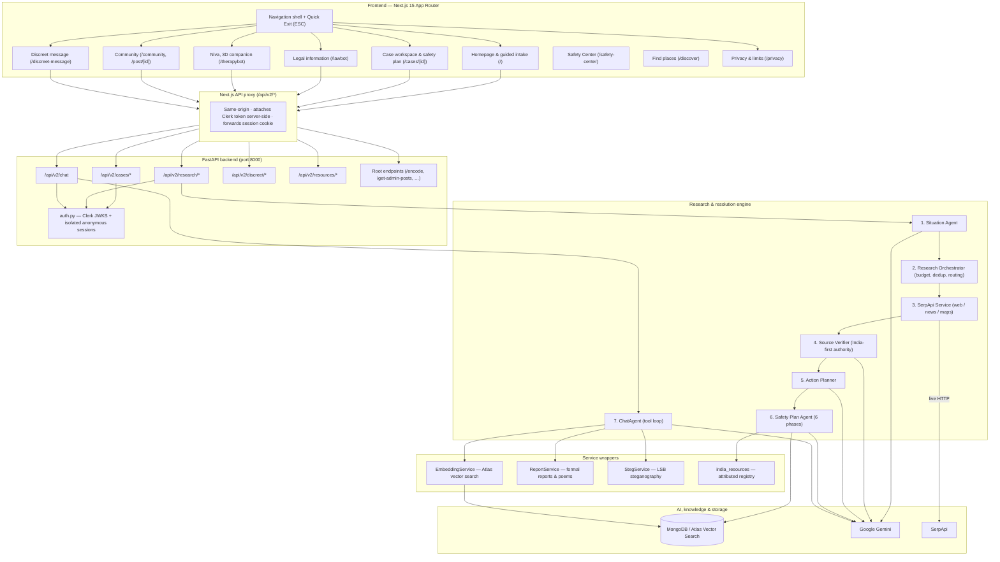

<div align="center">

# HerWay

### *A Silent Shield, A Strong Voice — AI-powered women's safety and real-world case resolution for India*

[](https://fastapi.tiangolo.com)
[](https://nextjs.org)
[](https://www.typescriptlang.org)
[](https://python.org)
[](https://mongodb.com)
[](https://serpapi.com)
[](https://ai.google.dev)
[](#-testing)
[](https://opensource.org/licenses/MIT)

---

**HerWay** is a trauma-informed platform for women in India navigating unsafe,
abusive, or legally complex situations. It combines **discreet communication**,
**live research against official sources**, **grounded legal information**,
**emotional support**, **anonymous peer community**, and **living safety plans**
that persist across visits.

[**Architecture**](#-system-architecture) • [**Quick Start**](#-quick-start) • [**Features**](#-core-capabilities) • [**API**](#-api-reference) • [**Design principles**](#-design-principles)

---

</div>

## 🌟 The problem

Globally **1 in 3 women** experiences physical, emotional, or sexual abuse. In
coercive-control situations three things compound the danger:

- **Devices are monitored.** Browser history, messages and app lists are
  routinely checked, so asking for help directly is hazardous.
- **Support is hard to reach.** Legal aid and trauma-informed mental health
  services exist in India but are poorly signposted and vary by district.
- **Generic advice is dangerous.** A survivor needs *her* district's One Stop
  Centre and *current* procedure — not a blog post, and not a US helpline.

### How HerWay is built

1. **Safety shield** — LSB steganographic messages hidden in ordinary photos, a
   3D empathetic companion (Niva), RAG-grounded Indian legal information
   (LawBot), anonymous community experiences, formal report drafting, and a
   global quick exit.
2. **Research pipeline** — a multi-agent engine that reads a situation,
   decides *whether* a search is needed, queries live sources through SerpApi,
   scores source authority, and assembles a safety plan with a persistent case
   workspace.
3. **Bi-directional bridges** — any standalone tool can be promoted into a
   Guided Case, and any case pre-loads its context into LawBot, Niva and
   community search.

---

## 🧭 Design principles

These are enforced in code and asserted in tests, not aspirations.

| Principle | What it means in practice |
|---|---|
| **Never invent a fact** | No phone number, address, section number or deadline appears unless it came from a source. When research fails, HerWay says so rather than answering from model memory. |
| **Show provenance, always** | Every resource is labelled `official_source`, `likely_official`, or `unverified_listing` — with a plain-English reason. A Google Maps pin is never presented as a confirmed government service. |
| **Partial is not complete** | If the web search succeeds but the nearby-centre search fails, the UI says exactly that. A partial result is never displayed as a whole one. |
| **Safety mandates are absolute** | Plans never suggest confronting the person causing harm. Evidence-gathering steps always carry an "only if it is safe" caveat. |
| **India-first** | `gl=in`, Indian statutes (PWDVA 2005, POSH Act 2013, BNS/IPC, IT Act), Indian helplines only, `.nic.in` recognised as government. Never assumes a city. |
| **The server decides who you are** | Case ownership is resolved from a verified session, never from a client-supplied `user_id`. |
| **Claims must be accurate** | Quick Exit is described as what it is — an immediate redirect that *cannot* erase browser history. See [`/privacy`](frontend/src/app/privacy/page.tsx). |
| **No safety verdicts about places** | Search results cannot establish whether somewhere is safe. There is no safety-score field in the codebase, comparisons carry no ranking, and an absence of bad news is never read as evidence of safety. |
| **Attempted is not completed** | Agent executions distinguish *proposed → attempted → completed*. A user is never told something was done when it was only tried. |
| **Emergency guidance never depends on a provider** | Urgency detection and emergency steps are deterministic Python. They work with Gemini, SerpApi and the database all unavailable — which, during development, they often were. |

---

## 🏗️ System architecture



---

## 🚀 Core capabilities

### 1. Research pipeline

A user writes *"I am being threatened by my partner and I don't know what to do"*
(optionally with a city/district). HerWay runs:

```
[Situation narrative]
   │
   ├─► Situation Agent
   │     Separates KNOWN FACT from USER CLAIM from UNKNOWN. Never promotes a
   │     claim to a fact. Assigns category + urgency.
   │
   ├─► Research Orchestrator
   │     Decides whether a search is needed at all, picks the vertical,
   │     enforces a search budget (4 normal / 6 critical), scrubs PII from
   │     queries, deduplicates, and runs tasks concurrently.
   │
   ├─► SerpApi Service
   │     Live web / news / maps. Every failure mode is distinguished:
   │     not_configured · timeout · rate_limited · auth_failed · http_error ·
   │     malformed_response — so "no results" never looks like an outage.
   │
   ├─► Source Verifier
   │     Score = 0.40·Authority + 0.25·Agreement + 0.20·Directness + 0.15·Freshness
   │     India-first tiers: Govt of India > State > Police/Legal Services >
   │     NGO > News > General web. Flags contradictions between sources.
   │
   ├─► Action Planner        — phased steps, each linked to the evidence behind it
   └─► Safety Plan Agent     — six phases, for safety categories only
```

**Safety plan phases:** `Right now` · `Next 24 hours` · `Document — only if safe`
· `Support network` · `Formal & legal options` · `Ongoing`.

Assessment uses **explicit boolean indicators with quoted justifications** —
never an arbitrary "risk: 87%" score.

### 2. Case workspace (`/cases/[id]`)

| Element | What it does |
|---|---|
| **Plan tab** | Interactive checklist by phase. Ticks are optimistic but roll back if the save fails — you never see a tick that wasn't persisted. |
| **Sources tab** | Per-source cards: the claim supported, source type, domain, authority/relevance/freshness breakdown, and any conflicts. Answers *"why are you telling me this?"* |
| **Resources tab** | Helplines and local services, each with its verification level. Live search for more, scoped to your district. |
| **Community tab** | Peer experiences matched by vector similarity. Contact details never shown. |
| **Ask HerWay** | Case-grounded assistant with tools: `search_web`, `search_news`, `search_local`, `invoke_lawbot`, `search_community`, `encode_message`, `generate_formal_report`, `adapt_safety_plan`, `search_safety_resources`, `update_action_status`. |
| **Research trail** | Every query, which engine, how many results, how long, and which failed. Stage ticks come from what actually happened. |

### 3. LawBot (`/lawbot`)

Answers are labelled so you can judge them:

> **Fact:** · **Legal information:** · **Possible option:** · **Needs verification:**

Cites Acts by name and year; gives a section number **only** when a retrieved
source states it. Always clear that this is legal information, not legal
advice, and that free legal aid is available to women through DLSA/NALSA.
Case-aware via `/lawbot?case_id=…`; "Save this as a case" works standalone.

### 4. Niva (`/therapybot`)

3D avatar (Three.js, `public/models/avatar.glb`) with browser speech synthesis
and a calm fallback if WebGL is unavailable. In therapy mode the agent
**does not escalate to legal steps or run searches** unless asked — it listens.
Surfaces Tele-MANAS **14416** when relevant. Sessions can be saved as a case.

### 5. Community (`/community`)

Anonymous shared experiences with search and severity filters. **Contact
details are stripped server-side** and never rendered. Every post offers
"Start case from this".

### 6. Discreet message (`/discreet-message`)

```
[Ordinary photo] + [your message]  ──►  LSB encode  ──►  [visually identical PNG]
                                                              │
[received photo]  ──►  LSB decode  ──►  [your message]  ◄──────┘
```

UTF-8 byte encoding, so **Hindi, Tamil, Bengali and other Indian scripts
round-trip correctly**. Capacity is checked before encoding. Nothing is stored
on the server.

> **This is not encryption.** The page says so prominently. It hides a message
> from a casual look. Someone technical can still find it, monitoring software
> still sees you type it, and chat apps that re-compress photos destroy it —
> send the file as a document attachment.

### 7. Safety Center (`/safety-center`)

Plans a user writes and keeps, separate from the AI-generated crisis plan
attached to a case. Several plans are supported ("getting home late", "when he
is released"), each with steps, trusted contacts, a safe word and an optional
review date.

**AI suggestions are kept outside the plan until accepted.** A suggestion sits
in a separate list and is shown as pending; accepting it moves it in and marks
it `accepted_suggestion`. If the user rewords it, her wording is what the plan
displays and the original is kept alongside for provenance.

Also here: trusted contacts, check-ins, and a share-draft builder.

> **Two things this deliberately does not do.**
> **It does not monitor check-ins** — HerWay has no reliable background
> execution, so "overdue" is computed when you look at it, nothing watches a
> timer, and nobody is alerted. **It does not deliver messages** — no SMS or
> WhatsApp provider is configured, so sharing opens *your* app with the text
> pre-filled and reports `delivery_guarantee: "none"`.
>
> Saving someone as a trusted contact **does not tell them**, and they have not
> agreed to anything.

### 8. Find places (`/discover`)

Everyday local discovery across 14 categories — hospitals, pharmacies, police,
One Stop Centres, legal aid, transport, accommodation. Results carry their
source, a retrieval timestamp and a provenance label; anything the provider did
not publish is shown as missing rather than guessed.

Side-by-side comparison is available, built only from fields the sources
actually supplied.

> **HerWay never says a place is safe.** Search results cannot establish that.
> There is no safety score anywhere in the codebase, comparisons carry no
> overall ranking, review sentiment is never converted into a verdict, and an
> absence of negative news is never treated as evidence of safety. Ratings are
> labelled as customer experience, not personal safety.

### 9. Safety & privacy

- **Quick Exit** — sticky button plus a global `ESC` listener, redirecting
  immediately. The tooltip and [`/privacy`](frontend/src/app/privacy/page.tsx)
  state plainly that it **cannot** erase browser history.
- **Emergency banner** — 112, 181, 1091 across the safety-relevant pages.
- **Anonymous by default** — no account required. Each browser gets its own
  isolated session, so anonymous users cannot see each other's cases.

---

## 🇮🇳 India-first behaviour

| Area | Implementation |
|---|---|
| **Search locale** | `gl=in`, `hl=en`. Jurisdiction appended to queries when absent — a plain search for "women helpline 181" otherwise returns a UK helpline first. |
| **Source authority** | `.gov.in` and `.nic.in` recognised as government (most Indian ministry portals are `.nic.in`). |
| **Helplines** | 112 ERSS · 181 Women Helpline · 1091 Women Police · 1098 CHILDLINE · 1930 Cyber Crime · 14416 Tele-MANAS. Each entry in [`india_resources.py`](backend/india_resources.py) carries the government page documenting it. |
| **Portals** | cybercrime.gov.in · SHe-Box · NCW · NALSA · One Stop Centre scheme · National Consumer Helpline · India Code. |
| **Local search** | One Stop Centre (Sakhi), Mahila Thana, District Legal Services Authority, cyber crime cell, Swadhar Greh. |
| **Location** | 28 states + 8 UTs dropdown, city, PIN validation. **Never assumes a city** — with no location, local search is skipped and the user is told. |
| **Formatting** | `+91 98765 43210`, `1 October 2026`, INR with lakh/crore grouping. |

What is **not** hardcoded: state helpline numbers, any street address, any
office phone number, opening hours. Those are discovered live and labelled with
their provenance.

---

## 🔄 Bi-directional case integration

| Feature | Standalone | Inside a case | Tool ➔ Case |
|---|---|---|---|
| **LawBot** | Ask any legal question | Opens with case evidence pre-loaded | "Save this as a case" |
| **Niva** | Calm companion conversation | Opens with safety plan context | "Save as a case" |
| **Community** | Browse and filter stories | Tab shows matching peer posts | "Start case from this" |
| **Discreet message** | Hide text in an image | Linked from the case header | — |
| **Formal reports** | — | `generate_formal_report` tool | Draft saved to the case |

---

## 📂 Project structure

```text
Haven-main/
├── backend/
│   ├── agents/
│   │   ├── action_planner.py        # Phased, evidence-linked action plans
│   │   ├── chat_agent.py            # Case assistant + tool loop
│   │   ├── research_agent.py        # Query planning & concurrent execution
│   │   ├── safety_plan_agent.py     # 6-phase adaptive safety plans
│   │   ├── situation_agent.py       # Fact / claim / unknown separation
│   │   └── source_verifier.py       # Authority scoring & contradiction detection
│   ├── models/                      # Pydantic domain models
│   │   ├── action_plan.py  case.py  research.py  safety_plan.py
│   │   ├── agent_envelope.py        # proposed / attempted / completed
│   │   └── safety_center.py         # Plans, contacts, check-ins, sharing
│   ├── routes/
│   │   ├── cases.py                 # /api/v2/cases/*
│   │   ├── chat.py                  # /api/v2/chat
│   │   ├── discreet.py              # /api/v2/discreet/*   (encode / decode)
│   │   ├── research.py              # /api/v2/research/*
│   │   ├── resources.py             # /api/v2/resources/*  (helplines, regions)
│   │   ├── discover.py              # /api/v2/discover/*   (local intelligence)
│   │   ├── safety_center.py         # /api/v2/safety-center/*
│   │   └── legacy.py                # Original root endpoints
│   ├── services/
│   │   ├── embedding_service.py     # Atlas vector search wrapper
│   │   ├── llm_service.py           # Gemini client + error classification
│   │   ├── maps_service.py          # India-specific local discovery
│   │   ├── report_service.py        # Formal reports & poems
│   │   ├── research_orchestrator.py # Budget, routing, dedup, quality loop
│   │   ├── serpapi_service.py       # SerpApi client + failure taxonomy
│   │   ├── search_cache.py          # Shared cache: memory | sqlite | mongodb
│   │   ├── resource_resolver.py     # Category + place -> normalised resources
│   │   ├── place_research.py        # Place profiles, review themes, comparison
│   │   ├── action_workflow.py       # do now / next / alternatives / save / share
│   │   ├── safety_center_repository.py  # Owner-scoped persistence
│   │   └── steganography_service.py
│   ├── utils/                       # embedding · steganography · text_llm
│   ├── auth.py                      # Clerk JWKS + anonymous session isolation
│   ├── india_resources.py           # Attributed registry & source hierarchy
│   ├── trace.py                     # Request-scoped trace IDs (contextvars)
│   ├── safety_triage.py             # Deterministic urgency — no LLM needed
│   ├── rate_limit.py                # Per-caller budgets (in-process)
│   ├── db.py  logger.py  main.py  prompts.py  schema.py
│   ├── tests/                       # 551 tests
│   └── requirements.txt
│
├── frontend/
│   ├── src/
│   │   ├── app/
│   │   │   ├── api/v2/[...path]/    # Proxy to the backend (same-origin)
│   │   │   ├── cases/[id]/          # Case workspace
│   │   │   ├── cases/               # Case list
│   │   │   ├── community/           # Community feed
│   │   │   ├── create-post/         # Share an experience
│   │   │   ├── discreet-message/    # Encode / decode
│   │   │   ├── lawbot/  therapybot/ post/[id]/  dashboard/
│   │   │   ├── safety-center/       # Plans, contacts, check-ins
│   │   │   ├── discover/            # Find and compare places
│   │   │   ├── privacy/             # What this does and does not protect
│   │   │   └── page.tsx             # Homepage & intake
│   │   ├── components/
│   │   │   ├── EvidenceCard.tsx     # Source transparency
│   │   │   ├── ResourceCard.tsx     # Provenance-labelled resources
│   │   │   ├── LocationPrompt.tsx   # State/UT/PIN picker
│   │   │   ├── States.tsx           # Loading / empty / error / partial
│   │   │   ├── HavenAvatar.tsx      # Three.js 3D companion
│   │   │   ├── ResearchTrailDrawer.tsx
│   │   │   └── ui/                  # Radix primitives
│   │   └── lib/
│   │       ├── api.ts               # Typed client with timeouts
│   │       ├── india.ts             # Phone / date / INR / regions
│   │       ├── server-auth.ts       # Server-side Clerk token
│   │       └── types.ts
│   └── public/models/avatar.glb
│
├── docs/
│   ├── EXISTING_ARCHITECTURE_AUDIT.md   # What is verified, partial, broken, unverified
│   ├── INTEGRATION_ROADMAP.md           # Phase-by-phase plan, per-file
│   ├── KNOWN_ISSUES.md                  # Live issue register with priorities
│   ├── PHASE2_IMPLEMENTATION_REPORT.md  # Tracing, research consolidation, legacy security
│   ├── PHASE3_IMPLEMENTATION_REPORT.md  # Shared cache, local intelligence
│   └── PHASE4_IMPLEMENTATION_REPORT.md  # Safety Center, contacts, check-ins
│
├── .env.example                     # Every variable, with failure behaviour
├── ARCHITECTURE.md
├── VALIDATION_REPORT.md             # Feature health matrix & known risks
└── WOMEN_SAFETY_AUDIT.md
```

---

## ⚙️ Configuration

**[`.env.example`](.env.example) documents every variable and what happens when
it is missing.** Copy its two sections to `backend/.env` and
`frontend/.env.local`.

The app **starts with no optional integration configured**. Each feature that
needs a missing key reports an outage to the user rather than inventing a
result. `GET /health` tells you exactly what is live:

```json
{
  "status": "ok",
  "database": "in-memory",
  "integrations": { "gemini": true, "serpapi": true, "mongodb": true, "clerk": false },
  "degraded": ["clerk", "groq", "aws_bedrock"]
}
```

### Minimum to run locally

```env
# backend/.env
GEMINI_API_KEY=...        # agents; without it they return 503 honestly
SERPAPI_API_KEY=...       # live research
MONGODB_URI=mongodb://localhost:27017   # without it: in-memory, data lost on restart
```

```env
# frontend/.env.local
NEXT_PUBLIC_BACKEND_URL=http://localhost:8000
```

### Search cache

SerpApi bills per search, so results are cached. The backend is pluggable and
**defaults to in-process**, which adds no infrastructure dependency:

| `HERWAY_CACHE_BACKEND` | Sharing | Needs | Verified |
|---|---|---|---|
| `memory` *(default)* | none — per worker | nothing | — |
| `sqlite` | across workers on **one host** | a writable file path | ✅ across two real processes |
| `mongodb` | across hosts | the MongoDB you already run | ❌ unverified |

TTLs differ by content type, because news decays and a street address does not:
`CACHE_TTL_NEWS` 15 min · `CACHE_TTL_MAPS` 3 h · `CACHE_TTL_WEB` 1 h.

An unavailable cache backend degrades to in-process with a warning — a cache
outage never becomes a user-visible outage.

### Required in production

| Variable | Why |
|---|---|
| `HERWAY_ENV=production` | Enforces the safe configuration below. |
| `HERWAY_SESSION_SECRET` | Signs anonymous session cookies. |
| `MONGODB_URI` | The app **refuses to start** without a reachable database rather than silently losing saved cases. |
| `CLERK_ISSUER` + `CLERK_SECRET_KEY` | Real accounts. Without them the build refuses unless `HERWAY_ALLOW_AUTH_FALLBACK=true`. |
| `HERWAY_ADMIN_USER_IDS` | Allow-list for `/dashboard`. Empty means nobody has access. |

---

## 🛠️ Quick start

### Prerequisites
- **Node.js** 18.17+ or 20+
- **Python** 3.11–3.13
- **MongoDB** (local or a free Atlas cluster) — optional for a first look
- **SerpApi key** ([serpapi.com](https://serpapi.com)) and **Gemini key**
  ([aistudio.google.com](https://aistudio.google.com))

### 1. Backend

```bash
cd backend
python -m venv .venv

# Windows (PowerShell)
.\.venv\Scripts\Activate.ps1
# macOS / Linux
source .venv/bin/activate

pip install -r requirements.txt

# Run from `backend/` — see the note below about which .env loads
uvicorn main:app --reload --port 8000
```

> Backend: `http://localhost:8000` · Swagger: `http://localhost:8000/docs`
> · Health: `http://localhost:8000/health`

#### ⚠️ Which directory you run from decides which `.env` loads

`python-dotenv` searches upward from the **current working directory**, so:

| Run from | Loads |
|---|---|
| `backend/` | `backend/.env` |
| repository root | `.env` (repo root) |

If both files exist, these are two different configurations and the app will
silently use whichever one your shell happened to be sitting in. A root `.env`
copied from `.env.example` has every key present but **empty**, which starts the
backend with no Gemini and no SerpApi key — and the only symptom is features
reporting an outage.

**Keep your real keys in `backend/.env` and start from `backend/`**, or keep
them in the root `.env` and start from the root with
`uvicorn backend.main:app --reload --port 8000`. Either works; mixing them does
not. `GET /health` tells you which integrations actually came up.

> **Do not run two dev servers at once.** Next.js falls back to port 3001 when
> 3000 is taken, but both instances write to the same `frontend/.next/`
> directory and overwrite each other's compiled chunks. The symptom is
> `ChunkLoadError: Loading chunk app/<route>/page failed`. Stop every instance,
> delete `.next`, and start one.

### 2. Frontend

```bash
cd frontend
npm install
npm run dev
```

> Frontend: `http://localhost:3000`

The browser never calls the backend directly — everything goes through the
Next.js proxy at `/api/v2/*`, which keeps the session cookie first-party and
attaches the Clerk token server-side.

---

## 🧪 Testing

```bash
# Backend — 551 tests
backend/.venv/Scripts/python.exe -m pytest backend/tests -q     # Windows
python -m pytest backend/tests -q                               # macOS / Linux

# Frontend
cd frontend && npx tsc --noEmit && npm run lint && npm run build
```

**Almost every test is offline.** The suite exercises code paths, contracts and
failure handling — it does **not** demonstrate that Gemini, MongoDB or Atlas
work. Treat a green run accordingly. Two exceptions genuinely touch real
resources: the cross-process cache test spawns a second Python interpreter
against a real SQLite file, and `test_safety_center.py` verifies ownership
rules in-process.

| Suite | Covers |
|---|---|
| `test_authorization.py` | Cross-user access on every case endpoint; session isolation; rejected tokens |
| `test_e2e_cases.py` | All seven user flows + Gemini down, SerpApi down, invalid JSON, partial failure |
| `test_serpapi.py` | Normalization, caching, the full failure matrix, India locale |
| `test_llm_service.py` | Outage / quota / timeout classification; non-blocking execution |
| `test_safety_plan.py` | Six-phase generation, adaptation, preserved progress |
| `test_source_verifier.py` | Authority scoring, agreement, contradictions |
| `test_research_orchestrator.py` | Vertical routing, budget, dedup, degradation reporting |
| `test_women_safety.py` | Category routing, India resources, no-confrontation mandate |
| `test_trace.py` | Trace isolation across concurrent requests, hostile header rejection, cleanup after exceptions |
| `test_research_consolidation.py` | `ResearchAgent` compatibility after consolidation; budget, dedup, PII scrubbing |
| `test_safety_triage.py` | Conservative urgency, false-positive control, workflow routing |
| `test_legacy_security.py` | Rate limits, input validation, which legacy routes stay public |
| `test_agent_envelope.py` | attempted vs completed; failure isolation |
| `test_chat_agent_phase2.py` | All 14 tools present; mode discriminator; honest degradation |
| `test_search_cache.py` | Key normalization, TTLs, corrupt entries, cache outage, **real cross-process reuse** |
| `test_local_intelligence.py` | Resolver triggers, normalization, review themes, news claims, comparisons |
| `test_discover_routes.py` | Discovery endpoints, provider failure vs empty, rate limiting |
| `test_safety_center.py` | Plan/contact/check-in lifecycle, **cross-user authorization**, sharing honesty |
| `test_action_workflow.py` | Confrontation filter, proportionality, LLM-independent emergency guidance |

---

## 📡 API reference

**62 endpoints.** Swagger at `http://localhost:8000/docs` is generated from the
code and is always authoritative; the tables below are the curated subset.

| Group | Count |
|---|---|
| `/api/v2/safety-center` | 22 |
| `/api/v2/cases` | 11 |
| `/api/v2/discover` | 5 |
| `/api/v2/research` · `/api/v2/discreet` | 3 each |
| `/api/v2/resources` | 2 |
| `/api/v2/chat` | 1 |
| Original Haven endpoints (root) | 15 |

### Cases — `/api/v2/cases`

| Method | Endpoint | Description |
|---|---|---|
| `POST` | `/api/v2/cases` | Create a case. Ownership comes from the session — **no `user_id` in the body**. |
| `GET` | `/api/v2/cases` | List the caller's own cases. `?status=` `?limit=` |
| `GET` | `/api/v2/cases/{id}` | Full case: situation, evidence, plans, trace, degradations |
| `PATCH` | `/api/v2/cases/{id}` | Update title, status (`active`/`paused`/`resolved`/`archived`), location |
| `DELETE` | `/api/v2/cases/{id}` | Archive |
| `POST` | `/api/v2/cases/analyze` | Structure a narrative without saving it |
| `GET` | `/api/v2/cases/{id}/safety-plan` | The active safety plan |
| `PATCH` | `/api/v2/cases/{id}/actions/{action_id}` | Set a step's status |
| `POST` | `/api/v2/cases/{id}/safety-plan/adapt` | Re-plan after an escalation, preserving completed steps |
| `POST` | `/api/v2/cases/{id}/safety-plan/research-more` | Search for more local resources |

### Research — `/api/v2/research`

| Method | Endpoint | Description |
|---|---|---|
| `POST` | `/api/v2/research/{id}/run` | Run the pipeline. Returns `complete` or `partial` with `degradations[]`. |
| `GET` | `/api/v2/research/{id}/report` | Full research report |
| `GET` | `/api/v2/research/{id}/plan` | Action plan |

### Chat, discreet messaging, resources

| Method | Endpoint | Description |
|---|---|---|
| `POST` | `/api/v2/chat` | `{case_id?, message, history, mode?: "therapy"\|"legal"}` |
| `POST` | `/api/v2/discreet/encode` | multipart `message` + `file` ➔ base64 PNG |
| `POST` | `/api/v2/discreet/decode` | multipart `file` ➔ `{found, message, note}` |
| `GET` | `/api/v2/discreet/limitations` | What steganography does and does not protect |
| `GET` | `/api/v2/resources/national` | Helplines + portals, each with its official source URL. `?category=` |
| `GET` | `/api/v2/resources/regions` | Indian states and union territories |
| `GET` | `/health` | Status, database mode, per-integration availability |

### Local discovery — `/api/v2/discover`

| Method | Endpoint | Description |
|---|---|---|
| `GET` | `/api/v2/discover/categories` | Searchable categories. No search cost, not rate limited. |
| `POST` | `/api/v2/discover/resources` | `{category, location}` ➔ normalised listings with provenance and a retrieval timestamp |
| `POST` | `/api/v2/discover/place` | `{place_name, location?}` ➔ listing + review themes + limitations |
| `POST` | `/api/v2/discover/compare` | `{category, location, priorities[]}` ➔ comparison table. **No overall ranking.** |
| `POST` | `/api/v2/discover/area-reports` | Recent public reporting about an area, with claim types and inference limits |

A failed lookup returns `success: false`; a lookup that worked and matched
nothing returns `found_nothing: true`. These are never collapsed — "the search
broke" and "there are no hospitals nearby" are different answers.

### Safety Center — `/api/v2/safety-center`

| Method | Endpoint | Description |
|---|---|---|
| `POST` `GET` | `/plans` | Create / list user-owned plans. Several plans are supported. |
| `GET` `PATCH` `DELETE` | `/plans/{id}` | Read, edit, pause, archive, delete |
| `POST` | `/plans/{id}/steps` · `PATCH` `DELETE` `/steps/{step_id}` | Steps the user wrote |
| `POST` | `/plans/{id}/suggestions` | Record an AI suggestion — lands **outside** the plan until accepted |
| `POST` | `/plans/{id}/suggestions/{id}/accept` | Accept, optionally rewording. The user's wording wins. |
| `DELETE` | `/plans/{id}/suggestions/{id}` | Dismiss |
| `POST` `GET` | `/contacts` · `PATCH` `DELETE` `/contacts/{id}` | Trusted contacts. Adding one **never notifies them**. |
| `POST` `GET` | `/check-ins` · `GET` `/check-ins/active` | Start / list check-ins |
| `PATCH` `DELETE` | `/check-ins/{id}` | Mark safe, cancel, delete |
| `POST` | `/share-draft` | Prepare a message. Returns `delivery_guarantee: "none"`. |
| `DELETE` | `/all-data` | Delete every Safety Center record for the caller |

**All case, research, chat, discovery and Safety Center endpoints verify
ownership.** A case belonging to another session returns `403`; a Safety Center
record returns `404`, because confirming that someone else's safety plan exists
is itself a disclosure.

### Original endpoints (root mount)

| Method | Endpoint | Description |
|---|---|---|
| `POST` | `/text-generation` | Expand distress text (Gemini + Gemma) |
| `POST` | `/text-decomposition` | Parse text into structured attributes |
| `POST` | `/save-extracted-data` | Save a community post (field allow-list; no contact details stored) |
| `POST` | `/encode` · `/decode` | Legacy steganography — prefer `/api/v2/discreet/*` |
| `GET` | `/poem-generation` | Encouragement poem |
| `GET` | `/get-admin-posts` · `/get-post/{id}` | Community posts, contact details stripped |
| `GET` | `/find-match` | Vector similarity over an allow-listed collection |
| `POST` | `/close-issue/{id}` | Close a report — **requires sign-in** |
| `POST` | `/upload_embeddings/` | Index legal documents — **requires sign-in** |
| `POST` | `/generate-image` | Image generation via AWS Bedrock + S3 (503 when AWS is unset) |
| `POST` | `/img-generation` | Legacy image-prompt stub |
| `POST` | `/send-message` | Twitter share — **requires sign-in** |

These fourteen were classified rather than blanket-protected. The community
feed stays open on purpose: a woman reading other women's experiences, or
posting her own, should not have to create an account first. The risk those
routes actually carry is cost and volume, so each has a per-caller request
budget instead of a login wall — 20 paid-provider calls / 5 min, 10 submissions
/ 5 min, 120 reads / min. The policy table lives at the top of
[`backend/routes/legacy.py`](backend/routes/legacy.py).

Nothing carrying emergency information is rate limited: `/health` and
`/api/v2/resources/*` are exempt, because a limiter must never be the reason
someone cannot reach 112.

---

## 🔒 Security & privacy

1. **Server-side identity.** `backend/auth.py` verifies Clerk session tokens
   against JWKS. Anonymous visitors get a signed, httpOnly, per-browser session
   so their cases are isolated from each other.
2. **Ownership on every endpoint.** No endpoint accepts a caller-supplied
   `user_id`.
3. **Credentials stay server-side.** SerpApi, Gemini and database keys are
   never exposed to the browser; the Clerk token is attached in the proxy.
4. **PII scrubbing.** Names, emails and phone numbers are stripped from search
   queries before they leave the server.
5. **Community privacy.** Contact fields are removed server-side and never
   rendered.
6. **Honest limits.** [`/privacy`](frontend/src/app/privacy/page.tsx) states
   what HerWay cannot protect against: monitoring software, shared devices,
   browser history, and the fact that steganography is not encryption.

---

## 🛠️ Troubleshooting

**`{"errors":[{"message":"Invalid host","code":"host_invalid"}]}`**

Clerk could not match your publishable key to a real project. Almost always the
key is a placeholder rather than one copied from
[dashboard.clerk.com](https://dashboard.clerk.com). A publishable key is
`pk_test_`/`pk_live_` followed by the base64 of your Frontend API host, so a
plausible-looking key can still point at an instance that does not exist.

Decode yours to see where it points:

```bash
node -e "console.log(atob(process.argv[1].replace(/^pk_(test|live)_/,'')))" "$NEXT_PUBLIC_CLERK_PUBLISHABLE_KEY"
```

Clerk names development instances `<word>-<word>-<number>.clerk.accounts.dev`.
If yours decodes to something else, it is not a real instance.

HerWay checks this at startup. When the keys are unusable it says so and runs in
anonymous-session mode instead of loading a Clerk SDK that will fail on every
request — every feature still works except cases following a user across
devices. The check lives in
[`clerk-config.ts`](frontend/src/lib/clerk-config.ts) and is shared by
`next.config.ts`, the middleware and the server helpers so they cannot disagree.
Override it with `HERWAY_TRUST_CLERK_KEYS=true` if you have a genuine key it
rejects.

> Next.js reads `.env.local` at startup only — restart the dev server after
> editing it.

**`ChunkLoadError: Loading chunk app/<route>/page failed`**

Two processes are writing to `frontend/.next/` at once. Either two dev servers
are running (Next falls back to port 3001 when 3000 is taken, and both share the
same build directory), or `npm run build` ran while `npm run dev` was live — the
production build replaces the dev chunks the running server is still serving.

Stop every Node process, delete `.next`, start one server, and hard-reload the
browser (`Ctrl+Shift+R`) to drop the cached broken chunk.

**`[WinError 10013] An attempt was made to access a socket…`**

On Windows this usually means the port is already in use, not a permissions
problem. Find and stop the holder:

```powershell
netstat -ano | findstr :8000
taskkill /PID <pid> /F
```

**Features report an outage even though your keys are set**

You are almost certainly loading the wrong `.env` — see the warning in
[Quick start](#1-backend). Check `GET /health`: it reports which integrations
actually came up, and `"database": "in-memory"` means MongoDB is not connected
and **data will be lost on restart**.

---

## ⚠️ Known limitations

Full detail in [`docs/`](docs/) — the architecture audit, the per-phase reports
and [`KNOWN_ISSUES.md`](docs/KNOWN_ISSUES.md). The ones that matter most:

**Unverified infrastructure.** These are not known-broken; they are *unproven*,
because the environment this was built in could not reach them:

- **MongoDB persistence has never been verified.** All development ran on the
  in-memory fallback, where **data is lost on restart**. Safety plans, trusted
  contacts and check-ins inherit this. `GET /health` reports
  `"database": "in-memory"` when you are in that mode. Production refuses the
  fallback outright, but a real create → restart → reload cycle has not been
  performed.
- **Clerk sign-in is unverified.** The anonymous path works and is tested; the
  authenticated path is only tested for its rejection cases. With Clerk
  unconfigured, Safety Center records key to a browser session — **clearing
  cookies loses them**.
- **No live LLM validation.** The Gemini free tier is ~20 requests/day and was
  exhausted throughout development, so no LLM-backed output has been checked
  against a real model response.
- **Cross-host cache sharing is unverified.** The SQLite backend is proven
  across processes; the MongoDB backend is contract-tested only.

**Known broken:**

- **LawBot retrieval.** Three separate faults: the embedding model was retired
  (fixed), the vector field path was wrong (fixed), and documents are stored as
  pickled binary, which Atlas `$vectorSearch` cannot index (**not fixed** —
  needs re-ingestion). LawBot falls back to live official-source search rather
  than answering from model memory.

**Accepted constraints:**

- **Rate limiting is per-process.** With N workers a caller effectively gets N×
  the budget, and it resets on restart. It stops casual abuse; it is not a
  defence against a distributed attacker, and a real edge/WAF limit is still
  needed.
- **No message delivery.** No SMS or WhatsApp provider is configured, by
  choice — adding a paid one to make the UI look complete would have meant
  shipping a delivery promise that could not be kept.
- **No background scheduling**, so no server-side check-in reminders.
- **No encryption-at-rest claim.** Nothing in this repository configures it.
- **Safety plan quality has not been reviewed by a DV professional.** Prompts
  enforce structure and the no-confrontation mandate, but expert review is
  needed before real-world use.
- **No CI.** 551 tests, nothing runs them automatically.
- **No automated frontend tests** — there is no test runner in the frontend.
- `google-generativeai` is deprecated upstream; migration to `google-genai` is
  pending. Two model retirements have already broken this app.

---

## 📄 License & acknowledgments

Licensed under the **MIT License**.

- **SerpApi** — live search retrieval
- **Google Gemini** — agentic reasoning and synthesis
- **Three.js** — the 3D companion
- **MongoDB Atlas** — persistence and vector similarity
- **Government of India** — MWCD, NCW, NALSA, MHA and the National Cyber Crime
  Reporting Portal, whose published resources HerWay links to directly

---

<div align="center">
<b>HerWay</b> — dedicated to safety, dignity and empowerment for every woman. 💜
</div>
