<div align="center">

# 🛡️ Haven  
### *A Silent Shield, A Strong Voice — AI-Powered Women's Safety & Autonomous Real-World Case Resolution*

[](https://fastapi.tiangolo.com)
[](https://nextjs.org)
[](https://www.typescriptlang.org)
[](https://python.org)
[](https://mongodb.com)
[](https://serpapi.com)
[](https://ai.google.dev)
[](https://opensource.org/licenses/MIT)

---

**Haven** is an end-to-end, trauma-informed AI platform built to empower women navigating dangerous, abusive, or legally complex situations. It unifies **discreet safety channels**, **autonomous real-world investigation powered by live search**, **RAG-grounded legal guidance**, **3D empathetic therapy with voice**, **anonymous community peer support**, and **living safety & action plans**.

[**Explore Architecture**](#-system-architecture) • [**Quick Start**](#-quick-start--installation) • [**Feature Tour**](#-core-capabilities--feature-deep-dive) • [**Bi-Directional Integration**](#-bi-directional-case-integration) • [**API Reference**](#-api-reference)

---

</div>

## 🌟 Vision & Problem Statement

Globally, **1 in 3 women** experiences physical, emotional, or sexual abuse in her lifetime. In crisis and coercive-control scenarios:
- **Digital Surveillance is Rampant**: Perpetrators routinely monitor browser history, text messages, phone logs, and app lists, making direct calls for help hazardous.
- **Access to Legal & Mental Health Support is Constrained**: Less than 14% of survivors have access to timely legal aid, and only 10% receive trauma-informed mental health assistance.
- **Information Overload & Misinformation**: In a crisis, survivors face generic or outdated advice rather than verified local shelter contacts, jurisdiction-specific statutes (e.g., PWDVA, POSH, IPC/BNS), and step-by-step safety roadmaps.

### The Unified Haven Architecture
Haven seamlessly bridges two complementary layers into a unified product experience:
1. **The Women-Centric Safety Shield (Original Haven)**: LSB steganographic distress transmission hidden inside everyday photos, 3D animated empathetic companion (Niva), RAG-powered Indian legal guidance (LawBot), anonymous community shared experiences, dual Gemini+Gemma formal report generation, inspirational poetry, and emergency quick-exit switches.
2. **Autonomous Real-World Problem Resolution (v2 Agent Pipeline)**: A multi-agent search and synthesis engine powered by **live SerpApi** that analyzes distress narratives, autonomously queries web/news/local/maps sources, verifies domain authority, and builds living safety plans with persistent case workspaces.
3. **Bi-Directional Case Bridges**: Any standalone tool (LawBot, TherapyBot, Community, Discreet Message) can be promoted into an active Guided Case with one click, and any Case Workspace pre-loads context into LawBot, Niva, and community search.

---

## 🏗️ System Architecture

```mermaid
flowchart TB
    subgraph Client["Unified Frontend (Next.js 14 App Router)"]
        UI_Nav["Unified Navigation Shell (Navbar with Quick Exit ESC)"]
        UI_Home["Homepage & Guided Intake (/page.tsx)"]
        UI_Case["Case Workspace & Living Safety Plan (/cases/[id])"]
        UI_Law["Legal Rights Advisor (/lawbot)"]
        UI_Therapy["3D Empathetic Avatar Niva (/therapybot)"]
        UI_Community["Anonymous Community (/community & /post/[id])"]
        UI_Stego["Discreet SOS Stego Studio (/create-post)"]
        UI_Admin["Authority Incident Dashboard (/dashboard)"]
    end

    subgraph Bridges["Bi-Directional Integration Layer"]
        B_Law["LawBot ↔ Case Context & Promotion"]
        B_Therapy["TherapyBot ↔ Living Safety Plan"]
        B_Comm["Community ↔ Case Creation ('Start case from this')"]
        B_Stego["Stego Share ↔ Save as Guided Safety Case"]
    end

    subgraph Gateway["FastAPI API Gateway (Port 8000)"]
        R_V2_Research["/api/v2/research/* (Autonomous Multi-Agent Pipeline)"]
        R_V2_Cases["/api/v2/cases/* (CRUD & Safety Assessment)"]
        R_V2_Chat["/api/v2/chat (Case-Aware Tool-Calling Assistant)"]
        R_Legacy["Root Endpoints (/encode, /decode, /text-generation, /find-match, etc.)"]
    end

    subgraph AgenticPipeline["Autonomous Research & Resolution Engine"]
        Agent_Sit["1. Situation Understanding Agent"]
        Agent_Plan["2. Research Planning Agent"]
        Agent_Serp["3. Live SerpApi Service (Web / News / Local / Maps)"]
        Agent_Verif["4. Source Verification & Trust Analysis Agent"]
        Agent_Action["5. Action Planning & Synthesis Agent"]
        Agent_Chat["6. ChatAgent (Tool Loop: LawBot, Stego, Community, Reports)"]
    end

    subgraph ServiceLayer["Reusable Service Wrappers (Zero Duplication)"]
        S_Embed["EmbeddingService (Atlas Vector Search RAG)"]
        S_Report["ReportService (Dual LLM Formal Reports & Poetry)"]
        S_Steg["StegService (LSB Image Steganography)"]
        S_Serp["SerpApiService (Live Google Search Client)"]
    end

    subgraph DataAI["AI, Knowledge & Storage Services"]
        DB_Mongo[(MongoDB Atlas / Vector Search)]
        AI_Gemini["Google Gemini (Flash / Pro)"]
        AI_Gemma["Gemma Text Expansion Fallback"]
        Ext_SerpApi["SerpApi Live Search Engine"]
    end

    UI_Nav --> UI_Home & UI_Case & UI_Law & UI_Therapy & UI_Community & UI_Stego
    UI_Home -->|Intake Narrative| R_V2_Cases
    UI_Case -->|Fetch Case / Tool Chat| R_V2_Cases & R_V2_Chat
    UI_Law -->|Legal Q&A & Case Bridge| B_Law --> R_V2_Chat & R_Legacy
    UI_Therapy -->|Voice Chat & Case Bridge| B_Therapy --> R_V2_Chat
    UI_Community -->|Search & Start Case| B_Comm --> R_Legacy & R_V2_Cases
    UI_Stego -->|Encode & Save Case| B_Stego --> R_Legacy & R_V2_Cases

    R_V2_Research --> Agent_Sit
    Agent_Sit --> Agent_Plan
    Agent_Plan --> Agent_Serp
    Agent_Serp -->|Live HTTP Queries| Ext_SerpApi
    Agent_Serp --> Agent_Verif
    Agent_Verif --> Agent_Action
    Agent_Action --> DB_Mongo

    Agent_Chat --> S_Embed & S_Report & S_Steg & S_Serp
    S_Embed --> DB_Mongo
    S_Report --> AI_Gemini & AI_Gemma
    S_Steg --> R_Legacy
    S_Serp --> Ext_SerpApi
```



---

## 🚀 Core Capabilities & Feature Deep-Dive

### 1. 🔍 Autonomous Real-World Case Resolution (Powered by SerpApi)
When a user describes a situation (*"My landlord locked me out illegally while my abusive partner is threatening me in Austin, TX"*), Haven dispatches an autonomous 5-stage research sequence:

```
[User Situation Narrative] 
   │
   ├──► [Stage 1: Situation Understanding]
   │       • Extracts core facts, urgency (Low/Medium/High/Critical), jurisdiction, timeline, missing context
   │
   ├──► [Stage 2: Research Planning]
   │       • Generates targeted search queries across Web, News, Local Shelters, and Maps
   │
   ├──► [Stage 3: Live SerpApi Execution]
   │       • Executes live HTTP queries (no hallucinated phone numbers or addresses)
   │       • Normalizes results into structured domain models (title, url, domain, snippet, rating, address)
   │
   ├──► [Stage 4: Source Verification & Trust Scoring]
   │       • Classifies domains: Official Government (.gov), Legal Aid (.org), Medical/Crisis vs General
   │       • Performs cross-source consensus verification and flags conflicting claims
   │
   └──► [Stage 5: Action Planning & Workspace Generation]
           • Synthesizes immediate safety steps, legal avenues, emergency contacts, local resources
           • Persists active case to MongoDB with interactive checklist tracking
```

#### Key Modules:
- **`SerpApiService`** (`backend/services/serpapi_service.py`): Typed client supporting `search_web()`, `search_news()`, `search_local()`, and `search_maps()` with retries, timeout management, parameter validation, and rate-limiting.
- **`SourceVerifier`** (`backend/agents/source_verifier.py`): Calculates authority scores (0–100%), extracts verifiable citations, and surfaces official helpline numbers.
- **`ActionPlanner`** (`backend/agents/action_planner.py`): Builds sequenced phases (`Immediate Safety (0–2 hrs)`, `Short-term Actions (24–48 hrs)`, `Follow-Up & Legal Steps`).

---

### 2. 🗂️ Interactive Case Workspace & Living Safety Plan (`/cases/[id]`)
A responsive command center designed for clarity during high-stress situations:

| Tab / Element | Contents & Capabilities |
| :--- | :--- |
| **Header Quick-Links** | One-click access to **💜 Talk to Niva** (case-grounded), **⚖️ Legal Help** (case-grounded), **🔒 Discreet Message**, and **How we researched this**. |
| **Safety / Action Plan Tab** | Interactive task checklist grouped by urgency. Users can mark steps done, track completion progress, and view safety warnings. |
| **Sources & Evidence Tab** | Verified source cards with trust badges (Gov, Legal, Crisis), clickable links, mapped phone numbers, address info, and ratings. |
| **Resources Tab** | Verified local crisis centers, One Stop Centres, and shelters with integrated SerpApi local maps search. |
| **Community Tab** | Displays peer experiences from the Haven community matching the current case via vector similarity. |
| **Interactive Assistant Drawer** | In-case conversational AI backed by `ChatAgent` with tool calling (`invoke_lawbot`, `search_community`, `encode_message`, `generate_formal_report`, `generate_poem`, `adapt_safety_plan`, `search_safety_resources`). |
| **Research Trail Drawer** | Complete transparency drawer detailing exact search queries dispatched, query timestamps, raw SerpApi snippets, and verification scores. |

---

### 3. ⚖️ Legal Rights & Constitution Advisor (`/lawbot`)
- **Direct & Grounded Modes**:
  - Standalone: Answers questions on Indian law, IPC/BNS sections, PWDVA 2005, POSH Act 2013, and consumer rights.
  - Case-Aware: When opened via `/lawbot?case_id=xxx`, answers are grounded in the verified case evidence via ChatAgent's `invoke_lawbot` tool.
- **Bi-Directional Case Promotion**: Users chatting with LawBot in standalone mode can click **"✨ Promote to Guided Case"** at any time to convert their legal inquiry into a structured case with an automated action plan.

---

### 4. 🤖 3D Empathetic Therapy Avatar Niva (`/therapybot`)
- **3D Real-Time Avatar**: Renders a 3D model (`/models/avatar.glb`) centered on face and shoulders using Three.js with mouse parallax tracking and graceful fallback.
- **Trauma-Informed Voice & Synthesis**: Integrates browser speech synthesis with rate/pitch modulation for calming delivery, natural voice selection, and a one-click mute/stop control.
- **Calming Interventions**: Guided 4-7-8 breathing exercises and supportive de-escalation dialogue.
- **Bi-Directional Case Connection**:
  - When linked with a case (`?case_id=xxx`), Niva has access to safety plan context and can trigger safety adaptations if the situation escalates.
  - In standalone mode, users can click **"✨ Save as Guided Case"** to convert their emotional support session into an active safety plan.

---

### 5. 🤝 Anonymous Community & Shared Experiences (`/community`)
- **Safe Peer Support**: Survivors read anonymous experiences shared by women who navigated similar domestic or workplace challenges. All personal identifiers are protected.
- **Search & Severity Filtering**: Real-time filtering by severity (High, Medium, Low) and keyword search.
- **Bi-Directional Case Creation**: Every community post features a **"✨ Start case from this"** button, allowing a survivor to immediately launch their own private safety case pre-populated with relevant context.
- **Post Details (`/post/[id]`)**: Detailed view with incident location mapped via Google Maps embed, activity timeline, and status tracking (pending/closed).

---

### 6. 🖼️ Discreet SOS Steganography Studio (`/create-post`)
Conceals help messages inside innocent photos (e.g., flowers, pets, food) before sharing them on social media or messaging platforms:

```
[Distress Keywords / Form] ──► [Gemini + Gemma Text Expansion] ──► [Formal Distress Report]
                                              │
                                              ▼
[Upload Ordinary Photo] ──────► [LSB Pixel Steganography] ──────► [Visually Normal Photo]
                                              │
                                              ▼
                             [Share on Socials / Save as Guided Case]
```

- **LSB Steganography**: Encodes text into the least significant bits of pixel data using Pillow and NumPy without altering the visual appearance of the image.
- **Anonymous Mode**: Distressed users can proceed anonymously without mandatory Clerk authentication.
- **Dual Text Expansion**: Expands brief distress notes using dual Gemini and Gemma models for resilience.
- **Bi-Directional Case Bridge**: Step 3 (`Share.tsx`) includes a **"✨ Save as Guided Safety Case"** button to automatically initialize an active case file.

---

### 7. 🚨 Safety & Emergency Features
- **Global Quick Exit (`ESC`)**: Sticky button and global keyboard listener redirect immediately to Google (`https://www.google.com`).
- **Emergency Helplines Banner**: Persistent display of official 24/7 helplines (**112** Police/Emergency, **181** Women Helpline, **1091** Women Police Desk) across Home, TherapyBot, and Community pages.

---

## 🔄 Bi-Directional Case Integration

Every core feature in Haven works both **independently** and **deeply integrated** with the Case Architecture:

| Feature | Standalone Usage | Inside a Case Workspace | Reverse Bridge (Tool ➔ Case) |
| :--- | :--- | :--- | :--- |
| **LawBot** (`/lawbot`) | Ask any legal question directly. | Header button opens LawBot with case evidence pre-loaded. | **"Promote to Guided Case"** button creates case from chat. |
| **TherapyBot** (`/therapybot`) | Calming 3D companion conversation. | Header button opens Niva with safety plan context. | **"Save as Guided Case"** button turns session into case. |
| **Community** (`/community`) | Browse and filter shared stories. | Dedicated tab displays peer posts matching current case. | **"Start case from this"** button creates case from post. |
| **Discreet Stego** (`/create-post`) | Hide help text in an image. | Header button opens stego creator; ChatAgent provides guide. | **"Save as Guided Safety Case"** button creates case on share. |
| **Formal Reports** | Dual Gemini/Gemma expansion in form. | ChatAgent `generate_formal_report` tool drafts report. | Generated reports can be downloaded or saved to case. |
| **Poem Generator** | Standalone `/poem-generation` route. | ChatAgent `generate_poem` tool provides words of strength. | Integrated directly into chat drawer. |

---

## 📂 Project Directory Structure

```text
Haven-main/
├── backend/
│   ├── agents/                     # Autonomous AI Agents & Tool Registries
│   │   ├── action_planner.py       # Synthesizes phased action plans & steps
│   │   ├── chat_agent.py           # In-case assistant with full tool loop (LawBot, Stego, etc.)
│   │   ├── research_agent.py       # Query generator & research coordinator
│   │   ├── situation_agent.py      # Narrative decomposition & entity extraction
│   │   └── source_verifier.py      # Domain authority & consensus scoring
│   ├── routes/                     # FastAPI Endpoints
│   │   ├── cases.py                # /api/v2/cases/* — Case CRUD & safety assessment
│   │   ├── chat.py                 # /api/v2/chat — Case-aware conversational assistant
│   │   ├── legacy.py               # Root endpoints — Stego, LawBot, posts, poems, images
│   │   └── research.py             # /api/v2/research/* — Multi-stage research pipeline
│   ├── services/                   # Core & External Services
│   │   ├── embedding_service.py    # Wrapper for Atlas Vector Search RAG (search_legal_docs)
│   │   ├── llm_service.py          # Unified LLM provider (Google Gemini Flash/Pro)
│   │   ├── report_service.py       # Wrapper for formal report & poem generation
│   │   ├── serpapi_service.py      # Robust SerpApi client (Web/News/Local/Maps)
│   │   └── steganography_service.py# Wrapper for LSB pixel encode/decode
│   ├── utils/                      # Low-level utilities
│   │   ├── embedding.py            # Gemini text-embedding-004 & Atlas vector search
│   │   ├── steganography.py        # LSB image encoding & decoding
│   │   └── text_llm.py             # Dual Gemini/Gemma text expansion & poem generation
│   ├── db.py                       # MongoDB connection & indexes
│   ├── logger.py                   # Structured logging utility
│   ├── main.py                     # FastAPI application entrypoint
│   ├── models/                     # Pydantic schemas and domain models
│   ├── requirements.txt            # Base backend dependencies
│   └── requirements-v2.txt         # Enhanced agent & research dependencies
│
├── frontend/
│   ├── src/
│   │   ├── app/                    # Next.js 14 App Router
│   │   │   ├── cases/              # Case Workspace & Case List views
│   │   │   │   ├── [id]/page.tsx   # 3-Column Interactive Case Workspace
│   │   │   │   └── page.tsx        # Case History & Saved Cases
│   │   │   ├── community/          # Anonymous Support Community feed & search
│   │   │   ├── create-post/        # 3-Step Stego Studio & Post Submission
│   │   │   ├── dashboard/          # Authority Incident Management
│   │   │   ├── lawbot/             # AI Legal Advisor with Case Bridge
│   │   │   ├── post/               # Post detail view ([id]) & redirect
│   │   │   ├── therapybot/         # 3D Animated Therapy Avatar with Voice
│   │   │   ├── layout.tsx          # Root Layout with Clerk Auth, Theme & Navbar
│   │   │   └── page.tsx            # Main Landing & "What Happened?" Intake
│   │   ├── components/             # Reusable UI Components
│   │   │   ├── Navbar.tsx          # Unified Navigation with Quick Exit & Links
│   │   │   ├── HavenAvatar.tsx     # Three.js 3D Avatar with lip-sync & fallback
│   │   │   ├── PostDetail.tsx      # Community post view with 'Create Case' action
│   │   │   ├── Share.tsx           # Stego sharing with 'Save as Case' action
│   │   │   ├── InputForm.tsx       # Intake Form with Geolocation
│   │   │   ├── ResearchTrailDrawer.tsx # Live search transparency drawer
│   │   │   └── ui/                 # Accessible UI Primitives (Radix UI)
│   │   ├── lib/                    # Client utilities (cleanText, fetchCityName, cn)
│   ├── public/                     # 3D GLTF models (/models/avatar.glb), images
│   ├── package.json                # Frontend dependencies & scripts
│   └── tailwind.config.ts          # Styling & color tokens
│
├── ARCHITECTURE.md                 # Technical architecture & design rationale
├── WOMEN_SAFETY_AUDIT.md           # Safety, privacy & trauma-informed compliance audit
└── README.md                       # Comprehensive project documentation
```

---

## ⚙️ Environment Configuration

### 1. Backend Configuration (`backend/.env`)
Create `backend/.env` with the following keys:

```env
# ==============================================================================
# 1. CORE SEARCH & RESEARCH (Required for live real-world research)
# ==============================================================================
SERPAPI_API_KEY=your_serpapi_api_key_here

# ==============================================================================
# 2. AI MODEL PROVIDERS (Required: Google Gemini)
# ==============================================================================
GEMINI_API_KEY=your_google_gemini_api_key_here
GROQ_API_TOKEN=your_groq_api_token_here

# (Optional) AWS Bedrock & S3 Configuration (for legacy Titan image gen)
AWS_ACCESS_KEY_ID=your_aws_access_key_id
AWS_SECRET_ACCESS_KEY=your_aws_secret_access_key
AWS_REGION=us-east-1
S3_BUCKET_NAME=your_s3_bucket_name

# ==============================================================================
# 3. DATABASE (MongoDB Atlas recommended for Vector Search)
# ==============================================================================
MONGO_ENDPOINT=mongodb+srv://<username>:<password>@cluster0.mongodb.net/haven?retryWrites=true&w=majority
# Or standard URI:
MONGODB_URI=mongodb://localhost:27017/haven

# ==============================================================================
# 4. GEOCODING & MAPS (Optional reverse geocoding)
# ==============================================================================
OPENCAGE_API_KEY=your_opencage_key_here
```

### 2. Frontend Configuration (`frontend/.env.local`)
Create `frontend/.env.local` with the following keys:

```env
# Clerk Authentication Keys (From https://dashboard.clerk.com)
NEXT_PUBLIC_CLERK_PUBLISHABLE_KEY=pk_test_...
CLERK_SECRET_KEY=sk_test_...

# Clerk Auth Route Mappings
NEXT_PUBLIC_CLERK_SIGN_IN_URL=/sign-in
NEXT_PUBLIC_CLERK_SIGN_UP_URL=/sign-up
NEXT_PUBLIC_CLERK_AFTER_SIGN_IN_URL=/
NEXT_PUBLIC_CLERK_AFTER_SIGN_UP_URL=/

# Backend API Endpoint
NEXT_PUBLIC_BACKEND_URL=http://localhost:8000
```

---

## 🛠️ Quick Start & Installation

### Prerequisites
- **Node.js** 18.17+ or 20+
- **Python** 3.10, 3.11, or 3.12
- **MongoDB** instance (Local or free MongoDB Atlas cluster)
- **SerpApi API Key** (Free tier available at [serpapi.com](https://serpapi.com))
- **Google Gemini API Key** (Free tier available at [aistudio.google.com](https://aistudio.google.com))

---

### Step 1: Clone Repository
```bash
git clone https://github.com/your-username/Haven.git
cd Haven
```

---

### Step 2: Backend Setup
Open a terminal in the root directory:

```bash
# 1. Navigate to backend
cd backend

# 2. Create Python virtual environment
python -m venv .venv

# 3. Activate virtual environment
# Windows (PowerShell):
.\.venv\Scripts\Activate.ps1
# Linux / macOS:
source .venv/bin/activate

# 4. Install dependencies
pip install -r requirements.txt -r requirements-v2.txt

# 5. Start the FastAPI server
uvicorn main:app --reload --host 0.0.0.0 --port 8000
```

> **Backend is now live at:** `http://localhost:8000`  
> **Interactive Swagger API Docs:** `http://localhost:8000/docs`

---

### Step 3: Frontend Setup
Open a second terminal window:

```bash
# 1. Navigate to frontend
cd frontend

# 2. Install dependencies
npm install

# 3. Start Next.js development server
npm run dev
```

> **Frontend is now live at:** `http://localhost:3000`

---

## 📡 API Reference

### 1. v2 Case & Research Pipeline (`/api/v2/*`)

| Method | Endpoint | Description | Payload / Query |
| :--- | :--- | :--- | :--- |
| `POST` | `/api/v2/cases` | Creates a new case and saves situation details | `{"user_id": "...", "situation_text": "...", "category": "..."}` |
| `GET` | `/api/v2/cases` | Lists saved cases (filtered by user_id) | `?user_id=...` |
| `GET` | `/api/v2/cases/{id}` | Retrieves full case detail (facts, plan, evidence) | Path parameter `{id}` |
| `POST` | `/api/v2/cases/analyze` | Generates initial situation facts & missing info | `{"situation_text": "..."}` |
| `POST` | `/api/v2/cases/{id}/research` | Dispatches live multi-agent SerpApi research | None (uses stored case narrative) |
| `POST` | `/api/v2/cases/{id}/actions/{idx}/toggle` | Toggles an action step's completion status | Path parameters `{id}`, `{idx}` |
| `POST` | `/api/v2/chat` | Case-grounded tool-calling conversational agent | `{"case_id": "...", "message": "...", "mode": "therapy|legal"}` |

---

### 2. Original Haven Endpoints (Root Mount)

| Method | Endpoint | Description |
| :--- | :--- | :--- |
| `POST` | `/text-generation` | Expands distress text using dual Gemini + Gemma models |
| `POST` | `/text-decomposition` | Parses raw text into structured attributes |
| `POST` | `/save-extracted-data` | Saves extracted incident report to the `admin` collection |
| `POST` | `/encode` | Conceals text in image pixel data using LSB steganography |
| `POST` | `/decode` | Extracts hidden text from an uploaded steganographic image |
| `GET` | `/poem-generation` | Generates an inspirational coping poem for distress |
| `GET` | `/get-admin-posts` | Retrieves all community/admin incident reports |
| `GET` | `/find-match` | Finds top matching reports using Atlas vector similarity |
| `GET` | `/get-post/{id}` | Retrieves a specific community post by MongoDB ObjectId |
| `POST` | `/close-issue/{id}` | Updates issue status to `closed` |
| `POST` | `/upload_embeddings/` | Generates and uploads legal document embeddings to MongoDB |

---

## 🔒 Security, Privacy & Trauma-Informed Design

1. **Quick Escape (`ESC`)**: Global key listener immediately redirects the active browser tab to Google.
2. **Stateless Discretion**: Anonymous creation options enable survivors under device monitoring to generate steganographic help messages and browse peer stories without account registration.
3. **API Key Isolation**: SerpApi, Gemini, and database credentials remain strictly within the backend server environment.
4. **Verifiable Information**: Every phone number, address, and legal provision presented in action plans is verified through live search against official `.gov` registries, legal aid networks, and verified crisis desks.

---

## 📄 License & Acknowledgments

This project is licensed under the **MIT License** — see the [LICENSE](LICENSE) file for details.

- **SerpApi** for powering reliable, live real-world search retrieval.
- **Google Gemini** for high-speed agentic reasoning and natural language synthesis.
- **Three.js** for powering the 3D empathetic companion avatar.
- **MongoDB Atlas** for document persistence and vector similarity search.

---

<div align="center">
<b>Haven</b> — Dedicated to safety, dignity, and empowerment for every woman. 💜
</div>
